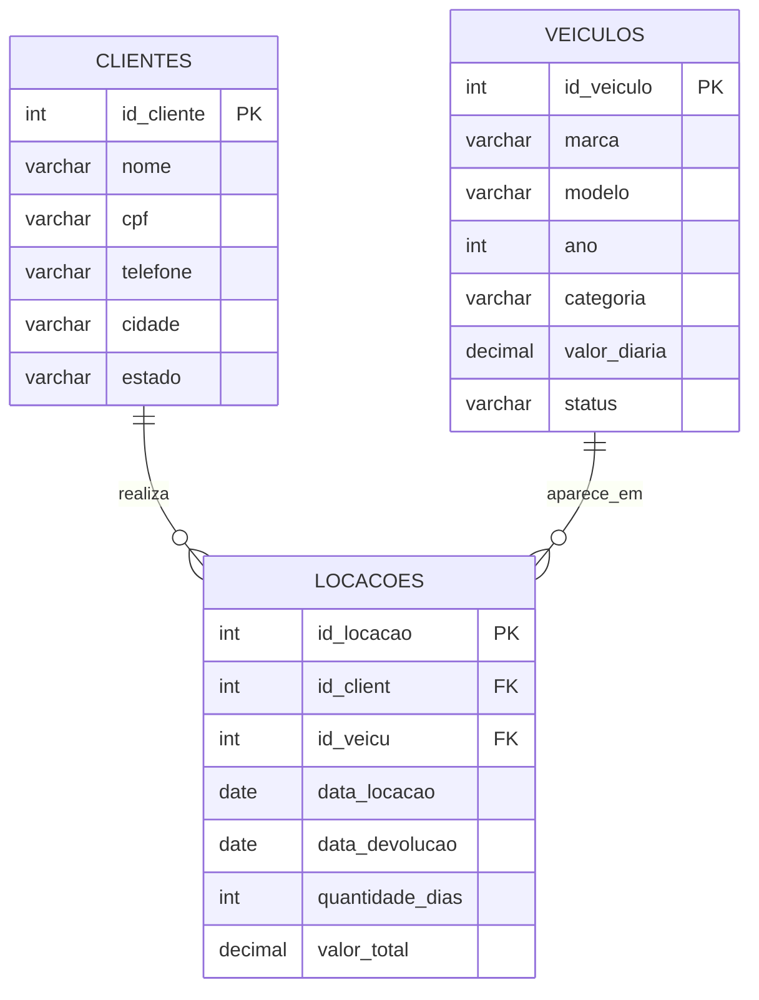

# MER: Modelo Entidade-Relacionamento

O Modelo Entidade-Relacionamento (MER) representa a estrutura de um banco de dados, mostrando as entidades, seus atributos e os relacionamentos entre elas.

## Exemplo: locadora de veículos

Uma locadora precisa cadastrar seus clientes e veículos e registrar cada locação. Para isso, podemos definir três entidades:

- **CLIENTES**: armazena os dados dos clientes. `id_cliente` é a chave primária (PK).
- **VEICULOS**: armazena os dados dos veículos. `id_veiculo` é a chave primária (PK).
- **LOCACOES**: registra as locações. `id_locacao` é a chave primária (PK); `id_client` e `id_veicu` são chaves estrangeiras (FK) que apontam para CLIENTES e VEICULOS.

## Como interpretar os relacionamentos

- Um **cliente** pode realizar nenhuma ou várias locações. Cada locação pertence a exatamente um cliente.
- Um **veículo** pode aparecer em nenhuma ou várias locações ao longo do tempo. Cada locação está relacionada a exatamente um veículo.
- A entidade **LOCACOES** conecta CLIENTES e VEICULOS. Por isso, as chaves estrangeiras ficam em LOCACOES.

Em resumo, CLIENTES e VEICULOS têm relacionamentos de um para muitos (1:N) com LOCACOES.
